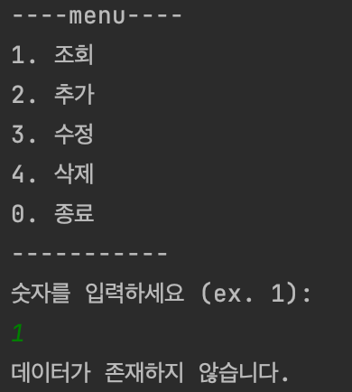

# CRUD Project 만들어보기

### 실행화면
1. menu 보여주기

   
2. 데이터 추가
   
   
   
3. 데이터 조회
   
    * 3-1. 데이터가 없을 때
      
      
      
    * 3-2. 데이터가 있을 때
      
      
   
4. 데이터 수정
   
   
   
   수정 후 조회 한 화면
   
   
   
5. 데이터 삭제
   
   
   
   삭제 후 조회 한 화면
   
   
   
6. 시스템 종료
   
   
